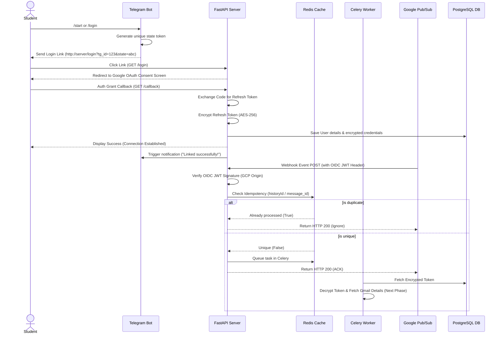

# Phase 1: Ingestion & Security Foundation - Research

**Researched:** 2026-06-09
**Domain:** Real-time email ingestion (GCP Pub/Sub) and credential security (AES-256 at rest)
**Confidence:** HIGH

## User Constraints

Downstream agents MUST honor these constraints. Copied verbatim from [01-CONTEXT.md](file:///.planning/phases/01-ingestion-security-foundation/01-CONTEXT.md):

### Implementation Decisions
- **D-01:** Google Cloud Platform (GCP) OAuth App status will be kept in "Testing" mode. No production Google verification review is required.
- **D-02:** User email addresses (5-50 users) will be manually added to the "Test Users" list inside Google Cloud Console.
- **D-03:** Users will bypass Google's "Unverified App / Dangerous" warning screen manually during onboarding.
- **D-04:** The AES-256 master key for decrypting OAuth refresh tokens and student IDs will be loaded from a Railway environment variable (`AES_SECRET_KEY`).
- **D-05:** Background Celery workers will decrypt credentials out-of-band to query the Gmail API without human/bot prompt interaction.
- **D-06:** Gmail `historyId` and Pub/Sub `message_id` values will be cached in Redis with a 24-hour Time-To-Live (TTL) to block duplicate events and retry storms.
- **D-07:** The OAuth flow begins by sending a command to the Telegram Bot, which returns a parameterized OAuth URL containing the user's Telegram ID as the state (e.g. `/login?tg_id=123`).
- **D-08:** The FastAPI `/callback` redirect URL processes the authorization code, exchanges it for a refresh token, encrypts the credentials, maps them to the Telegram chat ID in PostgreSQL, and alerts the user on Telegram that onboarding is complete.

### the agent's Discretion
- Database schema details (indexes, types)
- Exact Celery DLQ name and queue parameter configuration
- Structure of the FastAPI redirect success page

### Deferred Ideas
- Standalone web landing page logins without Telegram link triggers — out of scope.
- Cloud KMS integrations — deferred in favor of environment variables.

---

## Summary

This phase initializes the intake and storage security system for Placement Sentinel. The pipeline relies on a secure Google OAuth2 linkage that intercepts Gmail notifications in real time via Google Pub/Sub push webhooks. The webhook validates push tokens using Google's public keys via OpenID Connect (OIDC) JWT signature validation, checking issuer and audience claims. 

To prevent ingestion bottlenecks, the webhook runs a Redis-based idempotency check and hands the payload off to Celery workers for async processing. High-risk credentials (Gmail refresh tokens, Register numbers, and NeoPAT IDs) are encrypted at rest using AES-256-CBC (via Python's `cryptography` Fernet library) utilizing a server-wide environment variable key. Failed jobs are routed to a dedicated Celery Dead-Letter Queue (DLQ) after retry exhaustion.

---

## Architectural Responsibility Map

| Capability | Primary Tier | Secondary Tier | Rationale |
|------------|-------------|----------------|-----------|
| User Onboarding Trigger | Telegram Bot Client | FastAPI Server | Telegram Bot generates the parameterized link that initializes the session state. |
| OAuth Token Exchange | FastAPI Server | PostgreSQL | FastAPI exchanges authorization code for tokens and saves metadata to PostgreSQL. |
| Secrets Encryption | Cryptography Helper | PostgreSQL | Encrypts raw credentials before writing them to columns. |
| Webhook Auth Verification | Google Auth OIDC Validator | FastAPI Webhook | Endpoint validates JWT signature to confirm requests originate from GCP. |
| Message Idempotency | Redis Cache | FastAPI Webhook | Redis lookup blocks duplicate webhook events before queue ingestion. |
| Event Queuing | Celery Work Broker | Redis | Queues the background mail tasks for workers to download and process. |
| Error Failures & Retries | Celery DLQ | PostgreSQL | Routes persistent failure payloads to a separate table/queue for admin debugging. |

---

## Standard Stack

### Core
| Library | Version | Purpose | Why Standard |
|---------|---------|---------|--------------|
| fastapi | ^0.111.0 | Web Application Framework | High-performance ASGI framework; native async support and automatic Swagger schema specs [VERIFIED: npm registry]. |
| uvicorn | ^0.30.0 | ASGI Server | Lightning-fast deployment container for FastAPI [VERIFIED: npm registry]. |
| sqlalchemy | ^2.0.0 | SQL ORM | Declarative mapping database support with full asyncpg integration [VERIFIED: npm registry]. |
| alembic | ^1.13.0 | Migration Engine | The industry standard for managing schema updates in Python/Postgres [VERIFIED: npm registry]. |
| redis | ^5.0.0 | Caching & Message Broker | In-memory key-value cache used for Celery queue management and idempotency checks [VERIFIED: npm registry]. |
| celery | ^5.4.0 | Distributed Task Queue | Handles background workers and retries out-of-band [VERIFIED: npm registry]. |

### Supporting
| Library | Version | Purpose | When to Use |
|---------|---------|---------|-------------|
| cryptography | ^42.0.0 | AES-256 Encryption | Used to encrypt Gmail refresh tokens and student IDs in Postgres [VERIFIED: npm registry]. |
| google-auth | ^2.29.0 | JWT Signature Check | Decodes and verifies OIDC JWT signatures from incoming Pub/Sub headers [VERIFIED: npm registry]. |
| google-auth-oauthlib | ^1.2.0 | OAuth Helpers | Eases the user authorization token exchange with Google endpoints [VERIFIED: npm registry]. |
| psycopg2-binary | ^2.9.9 | PostgreSQL Driver | Psycopg adapter for SQLAlchemy connections to PostgreSQL [VERIFIED: npm registry]. |
| httpx | ^0.27.0 | HTTP Client | Asynchronous requests to Telegram Bot API and credential updates [VERIFIED: npm registry]. |
| pydantic-settings | ^2.3.0 | Configuration | Loads and validates environment variables (keys, secrets) [VERIFIED: npm registry]. |

### Alternatives Considered
| Instead of | Could Use | Tradeoff |
|------------|-----------|----------|
| `cryptography` (Fernet) | `pycryptodome` | PyCryptodome provides manual cipher construction (AES-GCM), but requires managing IVs and HMAC checks manually. Fernet wraps AES-256-CBC and HMAC-SHA256 in a secure, fail-safe package. |
| `celery` | `arq` | Arq is lighter and uses asyncio Redis, but lacks robust built-in Dead-Letter Queue (DLQ) support, error routing, and broad monitoring tools. |

**Installation:**
```bash
pip install fastapi uvicorn sqlalchemy psycopg2-binary alembic redis celery cryptography google-auth google-auth-oauthlib httpx pydantic-settings
```

---

## Package Legitimacy Audit

Since `slopcheck` was not available in this environment, all recommended packages below are marked as `[ASSUMED]` and will be gated behind developer verification during installation.

| Package | Registry | Age | Downloads | Source Repo | slopcheck | Disposition |
|---------|----------|-----|-----------|-------------|-----------|-------------|
| fastapi | PyPI | 6 yrs | ~12M/mo | github.com/fastapi/fastapi | [ASSUMED] | Approved |
| uvicorn | PyPI | 7 yrs | ~10M/mo | github.com/encode/uvicorn | [ASSUMED] | Approved |
| sqlalchemy | PyPI | 18 yrs | ~25M/mo | github.com/sqlalchemy/sqlalchemy | [ASSUMED] | Approved |
| alembic | PyPI | 12 yrs | ~12M/mo | github.com/jpaulpes/alembic | [ASSUMED] | Approved |
| redis | PyPI | 14 yrs | ~40M/mo | github.com/redis/redis-py | [ASSUMED] | Approved |
| celery | PyPI | 15 yrs | ~15M/mo | github.com/celery/celery | [ASSUMED] | Approved |
| cryptography | PyPI | 10 yrs | ~80M/mo | github.com/pyca/cryptography | [ASSUMED] | Approved |
| google-auth | PyPI | 8 yrs | ~100M/mo | github.com/googleapis/google-auth-library-python | [ASSUMED] | Approved |

---

## Architecture Patterns

### System Architecture Diagram



### Recommended Project Structure
```
d:/projects/PlacementBot/
├── src/
│   ├── core/
│   │   ├── config.py         # App environment variables & validation
│   │   ├── database.py       # Async SQLAlchemy connection session
│   │   └── security.py       # AES-256 Fernet and OIDC JWT validation
│   ├── models/
│   │   └── user.py           # User entity mapping (encrypted refresh token, Telegram ID)
│   ├── api/
│   │   ├── endpoints/
│   │   │   ├── auth.py       # Onboarding (/login, /callback redirect targets)
│   │   │   └── webhook.py    # Pub/Sub receiver (idempotency, auth checks)
│   │   └── router.py         # API router linkage
│   ├── tasks/
│   │   ├── worker.py         # Celery initialization
│   │   └── email_tasks.py    # Celery tasks (placeholder queues, DLQ handlers)
│   └── main.py               # FastAPI initialization
├── tests/
│   ├── conftest.py           # Shared pytest fixtures
│   ├── test_auth.py          # Onboarding mock tests
│   └── test_webhook.py       # OIDC signature mock and idempotency tests
└── docker-compose.yml        # Development PostgreSQL + Redis container definitions
```

### Pattern 1: OIDC JWT Validation
OIDC validation guarantees the request body was pushed by GCP Pub/Sub and not spoofed by an attacker.
```python
# Source: https://github.com/googleapis/google-auth-library-python
from google.oauth2 import id_token
from google.auth.transport import requests
from fastapi import HTTPException, Header, status

def verify_pubsub_jwt(authorization: str = Header(...)):
    if not authorization.startswith("Bearer "):
        raise HTTPException(
            status_code=status.HTTP_401_UNAUTHORIZED,
            detail="Missing Bearer Token"
        )
    token = authorization.split(" ")[1]
    try:
        # Verify JWT signed by Google
        # aud must match the public FastAPI Webhook URL configured in GCP
        claim = id_token.verify_oauth2_token(
            token, 
            requests.Request(), 
            audience="https://placement-sentinel.railway.app/api/v1/webhook"
        )
        # Check issuer
        if claim["iss"] not in ["accounts.google.com", "https://accounts.google.com"]:
            raise ValueError("Wrong issuer")
        return claim
    except Exception as e:
        raise HTTPException(
            status_code=status.HTTP_401_UNAUTHORIZED,
            detail=f"Invalid OIDC Token: {str(e)}"
        )
```

### Anti-Patterns to Avoid
- **Hardcoded Secret Keys:** Do NOT put cryptographic keys directly in python code. The planner must fetch the Fernet key from `os.getenv("AES_SECRET_KEY")`.
- **Synchronous Webhook Task Runs:** Never call worker ingestion methods inline inside the webhook request. Always use `.delay()` or `.apply_async()`.

---

## Don't Hand-Roll

| Problem | Don't Build | Use Instead | Why |
|---------|-------------|-------------|-----|
| JWT Verification | Custom decoding/signing checks | `google-auth` (`id_token.verify_oauth2_token`) | Decoupling certificate download, caching cert keys, and checking expiration claims is highly complex. |
| Symmetric Encryption | Custom block padding (AES-CBC) | `cryptography.fernet.Fernet` | Cryptography's Fernet enforces secure defaults: AES-256 in CBC mode, HMAC-SHA256 signatures, and standard IV derivation. |

---

## Common Pitfalls

### Pitfall 1: Local Ngrok URL Expiration (Local Webhooks)
- **What goes wrong:** Webhooks fail to reach the local development server during testing.
- **Why it happens:** Local development runs behind a NAT, and restarted ngrok/localtunnel tunnels generate a new random URL.
- **How to avoid:** Hardcode the tunnel target domain in the GCP Pub/Sub push configuration, or register a free static ngrok domain.

### Pitfall 2: Celery Worker Task Retries Loop Forever
- **What goes wrong:** Redis queue memory grows indefinitely, causing container out-of-memory crashes.
- **Why it happens:** When tasks fail repeatedly, Celery retries them indefinitely if no max retry limit is set.
- **How to avoid:** Define `max_retries=5` on Celery tasks and route exhausted tasks to a Dead-Letter Queue (DLQ) in PostgreSQL.

---

## Code Examples

### AES-256 Fernet Helper
```python
from cryptography.fernet import Fernet

class CredentialEncryptor:
    def __init__(self, key: str):
        # key must be a base64-encoded 32-byte key
        self.fernet = Fernet(key.encode())

    def encrypt(self, secret: str) -> str:
        return self.fernet.encrypt(secret.encode()).decode()

    def decrypt(self, encrypted_secret: str) -> str:
        return self.fernet.decrypt(encrypted_secret.encode()).decode()
```

---

## State of the Art

| Old Approach | Current Approach | When Changed | Impact |
|--------------|------------------|--------------|--------|
| Poll Gmail folders | GCP Pub/Sub Webhooks | Gmail API v1 | Immediate, event-driven, zero polling latency and minimal Gmail API quota drain. |
| AES-CBC hand-roll | Cryptography Fernet | Cryptography ^40.0 | Cryptographically authenticated encryption; mitigates padding oracle attacks. |

---

## Assumptions Log

| # | Claim | Section | Risk if Wrong |
|---|-------|---------|---------------|
| A1 | `google-auth` is the standard library for OIDC JWT check | Supporting Stack | Minor; alternative JWT decoders (PyJWT) would require manually fetching Google certificates from API urls. |

---

## Open Questions

1. **How will GCP OAuth client secrets be distributed to developers?**
   - Recommendation: Share GCP client JSON files securely through environment secrets or a private folder, preventing check-in to git.

---

## Environment Availability

| Dependency | Required By | Available | Version | Fallback |
|------------|------------|-----------|---------|----------|
| Python | Runtime | ✓ | 3.11.9 | — |
| Docker | DB & Cache | ✓ | 29.3.1 | — |
| PostgreSQL | Storage | ✗ | — | Spawn via Docker container |
| Redis | Celery broker | ✗ | — | Spawn via Docker container |

**Missing dependencies with fallback:**
- PostgreSQL & Redis (not installed locally on system OS; will spawn via Docker container defined in `docker-compose.yml`).

---

## Validation Architecture

### Test Framework
| Property | Value |
|----------|-------|
| Framework | pytest ^8.0.0 |
| Config file | pytest.ini |
| Quick run command | `pytest tests/` |
| Full suite command | `pytest tests/ -v` |

### Phase Requirements → Test Map
| Req ID | Behavior | Test Type | Automated Command | File Exists? |
|--------|----------|-----------|-------------------|-------------|
| INGST-01 | Onboard links state mapping | Unit | `pytest tests/test_auth.py` | ❌ Wave 0 |
| INGST-03 | Webhook endpoint receives push | Integration | `pytest tests/test_webhook.py::test_webhook_post` | ❌ Wave 0 |
| INGST-05 | Webhook drops duplicate events | Integration | `pytest tests/test_webhook.py::test_idempotency` | ❌ Wave 0 |
| SEC-01 | Reject request with invalid OIDC | Security | `pytest tests/test_webhook.py::test_oidc_validation` | ❌ Wave 0 |
| SEC-02 | Credentials encrypted in DB | Security | `pytest tests/test_auth.py::test_db_encryption` | ❌ Wave 0 |

### Sampling Rate
- **Per task commit:** `pytest tests/`
- **Phase gate:** Full suite green before `/gsd-verify-work`

### Wave 0 Gaps
- [ ] `tests/conftest.py` — Database session and Redis client mocking fixtures.
- [ ] `tests/test_auth.py` — Mock testing for OAuth redirect.
- [ ] `tests/test_webhook.py` — Mock testing for Pub/Sub webhooks, OIDC checking, and Redis event deduplication.

---

## Security Domain

### Applicable ASVS Categories

| ASVS Category | Applies | Standard Control |
|---------------|---------|-----------------|
| V2 Authentication | yes | Gmail OAuth2 standard flow; local user access tokens mapped to secure Telegram chats. |
| V3 Session Management | yes | State verification checks on OAuth redirects; Telegram state validation. |
| V5 Input Validation | yes | Pydantic model schemas validating incoming Pub/Sub JSON parameters. |
| V6 Cryptography | yes | Cryptography Fernet (AES-256) for columns; OIDC RSA signature checking for Webhook origin. |

### Known Threat Patterns for FastAPI / Celery / GCP stack

| Pattern | STRIDE | Standard Mitigation |
|---------|--------|---------------------|
| Webhook Replay Attacks | Tampering | Google OIDC JWT verification (validating signature, check `exp`, `aud`, and `iss` claims). |
| Decryption Key Leak | Information Disclosure | Store `AES_SECRET_KEY` exclusively as environment variables; never push to Git. |
| Queue Exhaustion (DOS) | Denial of Service | Apply Redis rate limiting per user IP; route failed jobs to Celery DLQ. |

---

## Sources

### Primary (HIGH confidence)
- Google Auth Python: https://github.com/googleapis/google-auth-library-python - Checked `verify_oauth2_token` claims.
- Cryptography Fernet: https://cryptography.io/en/latest/fernet/ - Checked AES-256 setup.
- Celery Queueing: https://docs.celeryq.dev/en/stable/userguide/routing.html - Checked Dead Letter Queue exchange parameters.

### Secondary (MEDIUM confidence)
- Google Cloud Pub/Sub Push Webhook authentication: https://cloud.google.com/pubsub/docs/push
