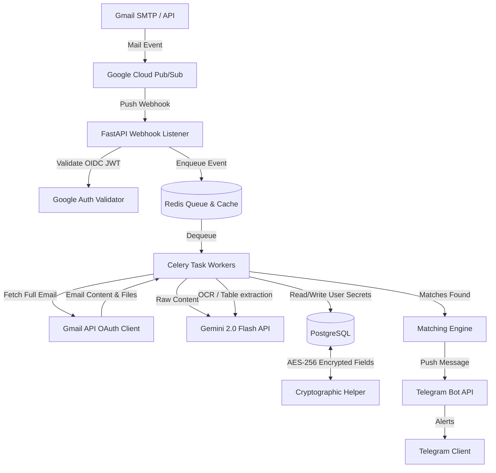

# Architecture Patterns

**Domain:** Secure, Real-time Placement Notification System
**Researched:** 2026-06-08

## Recommended Architecture



### Component Boundaries

| Component | Responsibility | Communicates With |
|-----------|---------------|-------------------|
| **FastAPI Webhook Listener** | Receives real-time POST messages from Pub/Sub, validates JWT origin, checks idempotency key in Redis, and pushes task to queue. | Google Pub/Sub, Redis |
| **Celery Tasks Worker** | Asynchronously loads Gmail details using user OAuth tokens, fetches attachments, forwards to Gemini API, runs matching engine, and executes notification. | Redis, Gmail API, PostgreSQL, Gemini API, Telegram API |
| **Database (PostgreSQL)** | Persistent storage of Users (encrypted IDs/tokens), processed Email metadata (idempotency logs), scheduled Events, and system Audit Logs. | Celery Workers, FastAPI Admin Panel (if applicable) |
| **Gemini AI Gateway** | Interfaces with Google's Gemini Flash. Handles JSON schema constraints for classification and processes attachment images/PDFs. | Celery Workers |
| **Cryptographic Helper** | Handles field-level encryption/decryption (AES-256-CBC/GCM) using a backend master key for all sensitive database columns. | Database & Worker interfaces |
| **Telegram Bot Dispatcher** | Constructs message payloads based on event categories and executes async HTTPS posts to Telegram APIs. | Celery Workers, Telegram API |

### Data Flow

1. **Watch Subscription Setup**: During onboarding, a user authenticates via Gmail OAuth. FastAPI requests `gmail.readonly` scope, stores the encrypted Refresh Token, and calls `gmail.users.watch()` to bind the mailbox to Google Pub/Sub.
2. **Push Event Ingestion**: An incoming email triggers a Pub/Sub push notification. The FastAPI listener validates the request's JWT token, extracts `emailAddress` and `historyId`, writes an idempotency key `gmail_event:{message_id}` to Redis, and dispatches a Celery task.
3. **Email Retrieval**: The Celery worker retrieves the user's decrypted refresh token, exchanges it for an access token, fetches the new email message via the Gmail API, and caches the raw attachments in temporary in-memory files.
4. **AI Parsing & Classification**: The worker passes the subject, body, and attachments (converted to base64 images/PDF arrays) to Gemini Flash. Gemini returns a structured JSON payload classifying the email type and extracting deadline, package, and company.
5. **Shortlist Matching**: The matching engine scans the Gemini response and parsed attachments for the user's decrypted registration number, name, or NeoPAT ID.
6. **Notification Bot**: If a shortlist match is verified or a high-priority opportunity is identified, Celery triggers a POST request to the Telegram Bot API to notify the user.
7. **Cleanup**: Temporary files and memory arrays holding attachments are forcefully garbage collected and deleted from disk immediately.

## Patterns to Follow

### Pattern 1: Out-of-Band Token Refresh
**What:** Exchange refresh tokens for short-lived access tokens (1 hour) only inside background workers just before calling Gmail APIs, never storing active access tokens.
**When:** Every API call executed by Celery.
**Example:**
```python
from cryptography.fernet import Fernet
import httpx

def get_gmail_client(encrypted_refresh_token: str, encryption_key: str):
    f = Fernet(encryption_key.encode())
    refresh_token = f.decrypt(encrypted_refresh_token.encode()).decode()
    
    # Request fresh access token from Google OAuth endpoint
    response = httpx.post("https://oauth2.googleapis.com/token", data={
        "client_id": GOOGLE_CLIENT_ID,
        "client_secret": GOOGLE_CLIENT_SECRET,
        "refresh_token": refresh_token,
        "grant_type": "refresh_token",
    })
    response.raise_for_status()
    return response.json()["access_token"]
```

### Pattern 2: Idempotent Event Handlers
**What:** Log processed `historyId` and `messageId` in Redis with a TTL of 24 hours. If an event is received again, return HTTP 200 immediately without reprocessing.
**Why:** Google Pub/Sub guarantees at-least-once delivery; duplicate push requests are common.

## Anti-Patterns to Avoid

### Anti-Pattern 1: Sync Processing in Webhooks
**What:** Parsing attachments and calling Gemini API synchronously inside the FastAPI endpoint.
**Why bad:** Gmail webhook endpoints must respond within 10 seconds, otherwise Google Pub/Sub marks the delivery as failed and retries. This creates a severe infinite retry storm.
**Instead:** Fast-ack Pub/Sub by pushing to Celery and returning HTTP 200 instantly.

### Anti-Pattern 2: Storing Raw Emails or Attachments
**What:** Saving raw email bodies or files to a persistent cloud bucket or database table.
**Why bad:** Creates massive security and privacy risks. If the database is compromised, all student emails are leaked.
**Instead:** Store only metadata (Company, Role, Classification, Match Status) and immediately wipe email payload data.

## Scalability Considerations

| Concern | At 50 users | At 10K users | At 1M users |
|---------|--------------|--------------|-------------|
| **Database IO** | Single shared SQLite or small Postgres instance is sufficient. | PostgreSQL with connection pooling (PgBouncer) and indexes on `email_address` and `history_id`. | Read/write replicas. Horizontally partitioned database tables (sharding by user group). |
| **API Rate Limits** | Minimal. Gmail API daily quota (1 billion units) is untouched. | Google API quotas require monitoring. Introduce back-off and queue rate limiters per user. | Dedicated GCP OAuth project credentials split across cohorts; rate limiting at ingress. |
| **AI Cost (Gemini)** | Negligible (less than $1/month using Flash pricing). | Higher costs. Implement structured caching of classification to skip LLM calls on identical email threads. | Cache results globally using hashing of email templates; route minor alerts to rule-based parser. |

## Sources
- FastAPI Scalability Patterns: https://fastapi.tiangolo.com/advanced/
- GCP Pub/Sub At-Least-Once Delivery: https://cloud.google.com/pubsub/docs/subscriber#at-least-once-delivery
- Gmail API Quotas: https://developers.google.com/gmail/api/reference/quota
